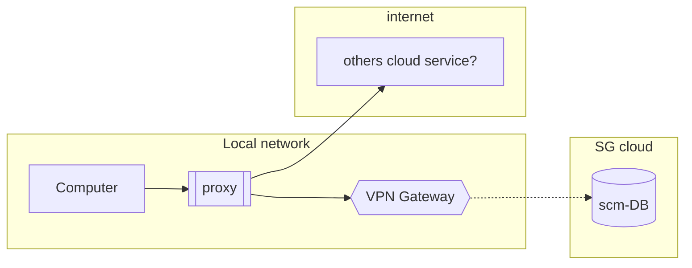
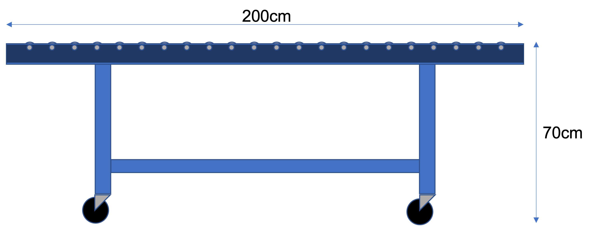

# 4️⃣Environment

## 4️⃣1️⃣Intranet environment

When we are connected to the internet and using a proxy server while browsing the web, that traffic goes through the proxy server instaed of coming directly from client PC. Due MIS policy, we were blocked some of cloud service such as Github, Google Cloud, MS Azure...

## 4️⃣2️⃣Roller conveyor
Roller conveyor is used to reduce human movement and staging area for awaiting scanning. The length of the conveyor is subject to one outer box base.
It can adjust height around 2cm only.

Below is the standard facility in warehouse 2m or 3m length and 0.6m width per one set,
