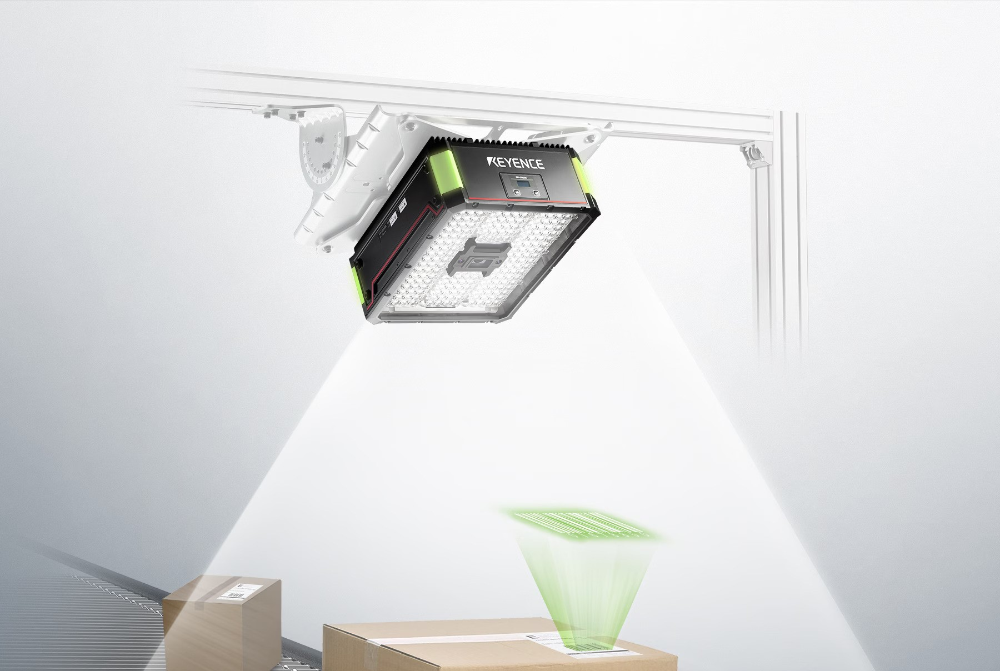
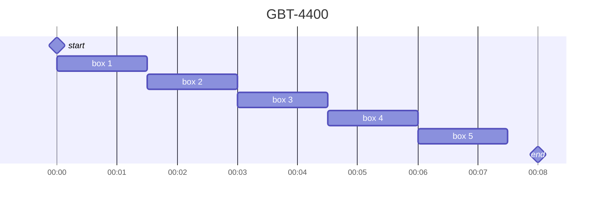

# 1️⃣Intro

In order to minimize human error and streamline operations in the process.
We are aim to improve efficiency for barcode scanning from single scan to batch scan using 
High-Speed Reading hardware([Keyence SR-5000](https://www.keyence.com/products/barcode/barcode-readers/sr-5000/)).

**Target**

1. Time saving when scanned by bundle base.
2. Consider to automate the part of process into our operation.

```mermaid
gantt

dateFormat s
title SR-5000
axisFormat %M:%S
start:  milestone, m2,0,0s
box 1~5: 0,1s
end: milestone, m2,1,0s
time saving 6.5s: crit,6.5s
```

