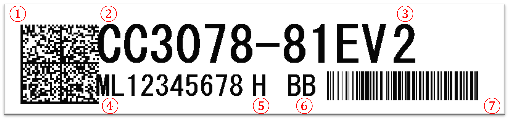

# 3️⃣Products package
## 3️⃣1️⃣Factory label specification

|No|Brevity code|Description|Data content|Remarks|
|---|---|---|---|---|
|1|2D|2D barcode(DataMatrix)|ML12345678    CC3078-81EV 2   H   BB      S12345678   S12345679|``UID``+``#09``+``SKU``+``#09``+``QTY``+``#09``+``PP``+``#09``+``MG``+{...``#09``+``SN``} - **Expandation of 'Tracking Code' is related with Package quantity. For example package quantity is 2, 'Tracking Code' should have two unique identity number** , **#09=Horizontal tab(ASCII HEX 09)**
|2|SKU|Item code|CC3078-81EV|
|3|QTY|Package quantity|2|
|4|UID|Unique ID|ML12345678|
|5|PP|Production Place|H|
|6|MG|Market Group|BB|
|7|1D|1D barcode(Code128)|CC3078-81EV|

## 3️⃣2️⃣List of package

|Type|Dimension(LxWxH)mm|MaxOfPackage|Illustration|MaxOfBoxPerBundle|Bundle illustration|
|---|---|---|---|---|---|
|BOX-008S|300 x 180 x 22|3||10||
|BX-004N|228 x 95 x 64|4||10||
|BX-005N|228 x 95 x 78|5||10||
|BX-006H|260 x 146 x 30|5||10||
|BOX-A|265 x 210 x 50|20||5||