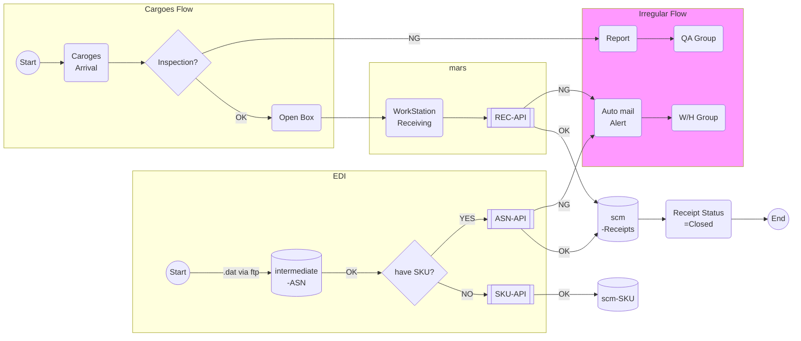
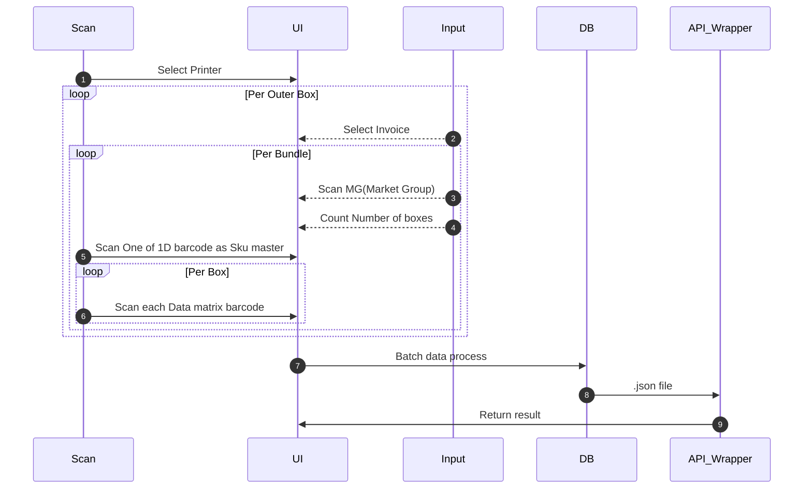
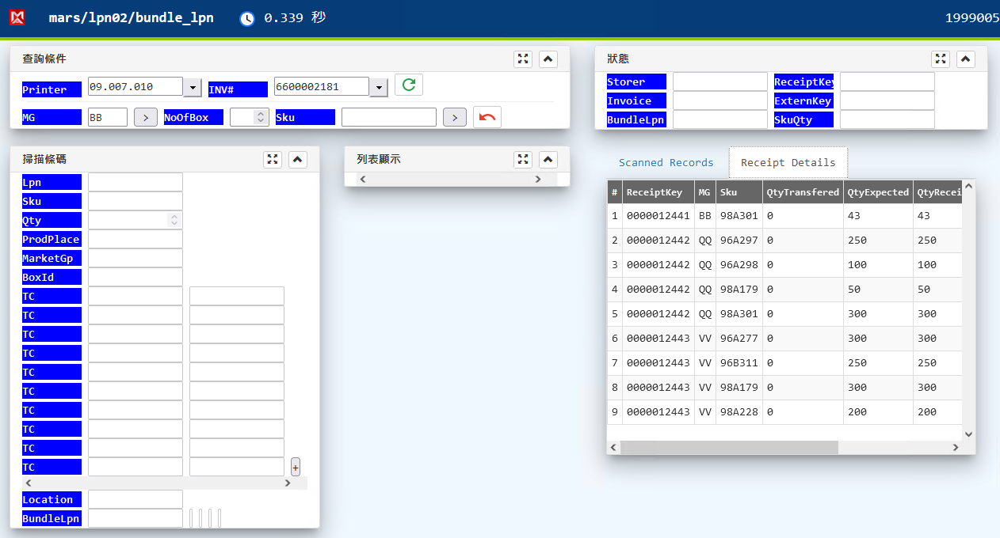

# 2️⃣Process flow

**Current flow chart overview**

```mermaid
flowchart LR;
e1((End))
DSA[(scm\n-Receipts)]
DIT[(scm-SKU)]
RSC(Receipt Status\n=Closed)
subgraph DF[EDI]
    s1((Start))
    ISA[(intermediate\n-ASN)]
    AIT[[SKU-API]] 
    CIT{have SKU?}
    ASA[[ASN-API]]
end
subgraph IF[Irregular Flow]
    RPT(Report)
    AMA(Auto mail\nAlert)
    WHG(W/H Group)
    QAG(QA Group)
end
subgraph CF[Cargoes Flow]
    s2((Start))
    ATA(Caroges\n Arrival)
    IQC{Inspection?}
    OPE(Open Box)
end
subgraph MS[mars]
    WFR(WorkStation\nReceiving)
    ABR[[REC-API]]
end
s1--.dat via ftp-->ISA--OK-->CIT--NO-->AIT--OK-->DIT
CIT--YES-->ASA--OK-->DSA
s2-->ATA-->IQC
IQC--OK-->OPE-->WFR-->ABR--OK-->DSA
ASA--NG-->AMA
ABR--NG-->AMA
DSA-->RSC-->e1

AMA-->WHG
IQC--NG-->RPT-->QAG

style IF fill:#f9f
```

**WorkStation Receiving sequence Diagram**

```mermaid
sequenceDiagram
autonumber
Scan->>UI: Select Printer

loop Per Outer Box
    Input-->>UI: Select Invoice
    loop Per Bundle
        Input-->>UI:  Scan MG(Market Group)
        Input-->>UI:  Count Number of boxes
        Scan->>UI:  Scan One of 1D barcode as Sku master
        loop Per Box
            Scan->>UI: Scan each Data matrix barcode
        end
    end
end
UI->>DB: Batch data process

DB->>API_Wrapper: .json file
API_Wrapper->> UI: Return result
```

**User Interface layout**
