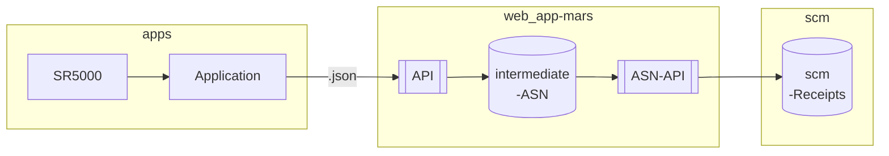
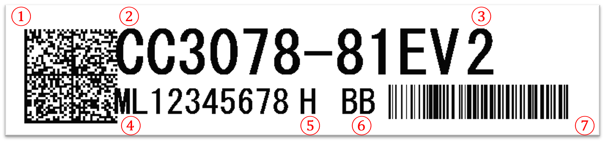

# 5️⃣Requirement

## 5️⃣1️⃣ Application

Create a software to connect with Keyence SR-5000 device, send and receive the necessary data to json data format via our api endpoint service.

### 5️⃣1️⃣1️⃣ Flow overview

### 5️⃣1️⃣2️⃣ Data format



|Field|Type|Remarks|
|---|---|---|
|[MODEL_CODE] |nvarchar(50)|=②SKU: CC3078-81EV2|
|[TRACKING_CODE]|nvarchar(10)|=①TrackingCode: S12345678,S12345679|
|[CASEID]|nvarchar(50)|=④UID: ML12345678|
|[TOID]|nvarchar(50)|=④UID: ML12345678|
|[RECEIPTKEY]|nvarchar(10)|TBC|
|[BUNDLE_LPN]|nvarchar(50)|BL202303251055("BL"+yyMMddhhmmss)|
|[LOCATION]|nvarchar(50)|defaultValue: STAGE|
|[QTY]|nvarchar(50)|defaultValue: 1|
|[LOTTABLE07]|nvarchar(50)|=⑤PP: H|
|[LOTTABLE10]|nvarchar(50)|=⑥MG: BB|
|[FLAG]|nvarchar(1)|defaultValue: 0|
|[addwho]|nvarchar(18)|TBC..device_information|

```jsx title=".json"
[
    {
        "MODEL_CODE":"CC3078-81EV2",
        "TRACKING_CODE":"S12345678",
        "CASEID":"ML12345678",
        "TOID":"ML12345678",
        "RECEIPTKEY":"",
        "BUNDLE_LPN":"BL2303251055",
        "LOC":"STAGE",
        "QTY":"1",
        "LOTTABLE07":"H",
        "LOTTABLE10":"BB",
        "FLAG":"0",
        "addwho":"[device_info]"

    },
    {
        "MODEL_CODE":"CC3078-81EV2",
        "TRACKING_CODE":"S12345679",
        "CASEID":"ML12345678",
        "TOID":"ML12345678",
        "RECEIPTKEY":"",
        "BUNDLE_LPN":"BL2303251055",
        "LOC":"STAGE",
        "QTY":"1",
        "LOTTABLE07":"H",
        "LOTTABLE10":"BB",
        "FLAG":"0",
        "addwho":"[device_info]"
    }
]

```

---
## 5️⃣2️⃣ On-site support

Support for workstation desgin and on-site installation.

## 5️⃣3️⃣ Documentation

Please use Markdown(MD or MDX) documentation for sharing software specification and troubleshooting docuement.